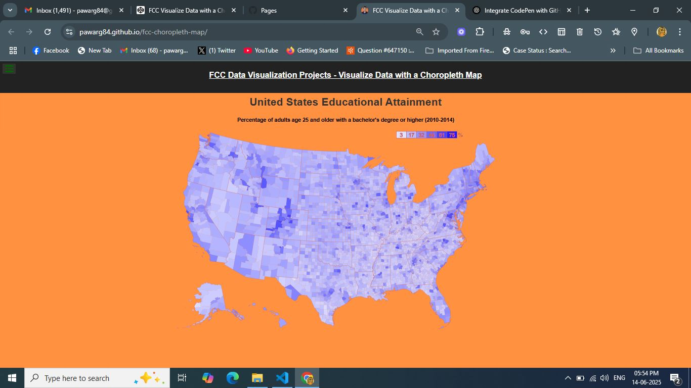

# 🗺️ FCC Visualize Data with a Choropleth Map

An interactive React + D3 choropleth map visualizing educational attainment across U.S. counties. Built as part of the FreeCodeCamp Data Visualization Certification.

> ✅ **Live Demo:**  
> 🔗 [https://pawarg84.github.io/fcc-choropleth-map/](https://pawarg84.github.io/fcc-choropleth-map/)

---

## 📸 Screenshot

---

## 📊 Features

- Choropleth map of U.S. counties (education %)
- Interactive tooltip on hover
- Color legend and dynamic scale
- Geo visualization using D3 + TopoJSON
- JSX + React components (via CDN)
- FCC test suite integration

---

## 🛠️ Tech Stack

- HTML, CSS
- React 16 (CDN)
- D3.js v4
- TopoJSON
- Babel (for JSX transpilation)
- FCC Test Suite

---

## 🧾 Original CodePen

This project was originally created on CodePen:  
🔗 [https://codepen.io/ganeshp007/pen/YzbEZXj](https://codepen.io/ganeshp007/pen/YzbEZXj)

---

## 🎓 Certification

This is one of the **FreeCodeCamp - Data Visualization Certification** projects  
🔗 [freecodecamp.org](https://www.freecodecamp.org/)

---

## 📦 Deployment

Deployed using **GitHub Pages**  
🔗 [https://pawarg84.github.io/fcc-choropleth-map/](https://pawarg84.github.io/fcc-choropleth-map/)

---

## 🙌 Author

**Ganesh Pawar**  
🔗 [GitHub @pawarg84](https://github.com/pawarg84)

